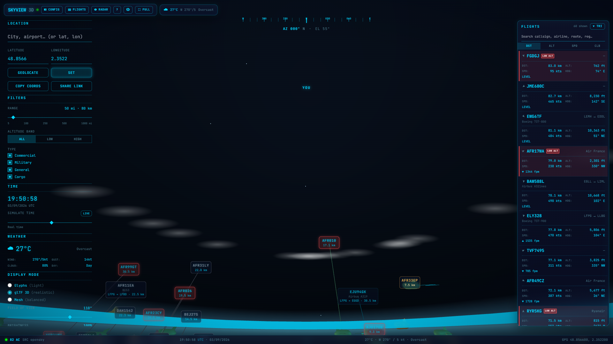
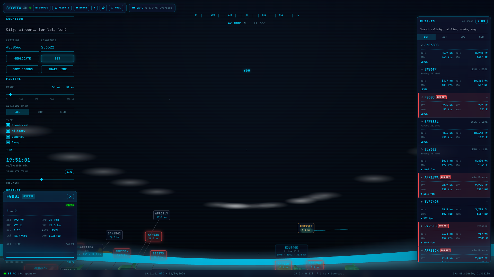
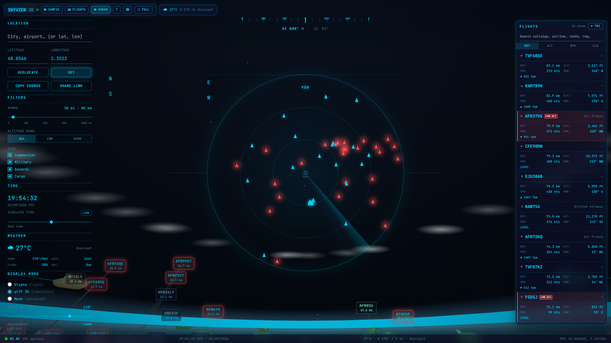
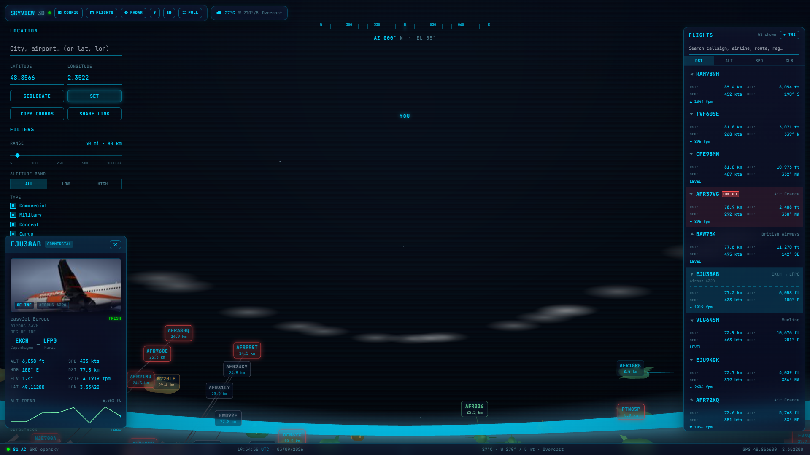

# SkyView 3D

*Look up — see what's flying over you right now. No receiver, no hardware, no setup.*

**Live demo: [https://skyview.faly.net/](https://skyview.faly.net/)**

SkyView 3D is **not another map dashboard**. Instead of a top-down globe, it renders the sky **from your position**: aircraft plotted on a Three.js dome by their true azimuth / elevation / distance from you, like a planetarium — inside a deep-navy, neon-cyan cockpit HUD. Open it, and in 10 seconds you see the planes overhead: callsign, airline, route, altitude, speed.

Everything runs locally: no telemetry is sent anywhere.

---

## Screenshots

Live traffic over Paris (OpenSky source, 80+ contacts):



Selecting a flight opens its detail card (airline, route, photo, altitude trend):



The 2D radar overlay (North-up, click a blip to select):



Aircraft photo, framed with registration and type (adsbdb enrichment):



---

## Features

- **Look-up view, not a map** — observer-centric sky dome (drag / arrows / presets). No globe, no tiles, no basemap.
- **No receiver needed** — live traffic from [adsb.fi](https://opendata.adsb.fi/) open data (up to 250 NM), a local ADS-B receiver (`dump1090`/`readsb`), or [airplanes.live](https://airplanes.live/) — only real traffic.
- **3 display modes**: lightweight glyph darts, procedural 3D mesh silhouettes, and a remote Apache-2.0 glTF aircraft model (falls back gracefully when unavailable).
- **Real sky layer** — sun (with rise/set), moon (with phase), bright stars and naked-eye planets at their true positions for your location + time.
- **Live weather (Open-Meteo, no API key)** — temperature, wind (speed + direction), and sky condition shown in the toolbar + status bar, with the 3D sky tinted to match.
- **Flight list** — searchable, sortable by distance/altitude/speed/climb; click to select.
- **Config & filters** — search any city/airport (geocode + airport DB), geolocate, set range, altitude band, aircraft-type toggles.
- **Aircraft enrichment (adsbdb)** — airline, route, aircraft type, registration and photo.
- **Privacy first** — zero data leaves your machine. Config persists locally; display prefs persist to `localStorage`.

---

## Why not another 3D tracker?

Most open-source ADS-B 3D projects (`tar1090`-style dashboards, deck.gl/Cesium globes) share two requirements: **a top-down map view** and **your own ADS-B receiver**. SkyView 3D inverts both:

| | Typical 3D tracker | SkyView 3D |
|---|---|---|
| View | Map / globe from above | **Sky dome from your position** (az/el) |
| Hardware | RTL-SDR + feeder required | **None — aggregator APIs** |
| Setup | Docker stack / tokens | `npm install && npm run dev` |
| Use case | Feed monitoring | **"What's that plane overhead?"** |

---

## Quick start

Requires **Node.js 20+**.

```bash
npm install
npm run dev
```

Open **http://localhost:5173/**. The default source is **OpenSky** (free, no receiver needed) with automatic rotation to adsb.fi on rate limits.

### Data sources

| Value | Meaning |
|---|---|
| `opensky` | **Real ADS-B** via the free [OpenSky](https://opensky-network.org/) network (anonymous access is rate-limited; fine for personal use). Default. |
| `adsbfi` | **Real ADS-B** via [adsb.fi](https://opendata.adsb.fi/) open data (up to 250 NM). Good fallback when OpenSky throttles you. |
| `radio` | Local `dump1090`/`readsb` `aircraft.json` (RTL-SDR). |
| `api` | Free [airplanes.live](https://airplanes.live/) point query (may be 403-blocked on some networks). |

On a source failure the app **auto-rotates** between sources (with per-source cooldowns for rate limits) and holds + **extrapolates** the last fix so aircraft keep moving between polls.

Set it with `DATA_SOURCE`, or switch live via `POST /api/source`.

```bash
# Windows (cmd.exe)
set DATA_SOURCE=radio && npm run dev

# PowerShell / macOS / Linux
DATA_SOURCE=radio npm run dev
```

### Environment

| Var | Default | Meaning |
|---|---|---|
| `DATA_SOURCE` | `opensky` | `opensky` · `adsbfi` · `radio` · `api` |
| `PORT` / `HOST` | `3000` / `0.0.0.0` | HTTP + WebSocket bind |
| `AIRCRAFT_JSON_URL` | `http://localhost:8080/data/aircraft.json` | dump1090 feed (radio source) |
| `API_URL` | `https://api.airplanes.live/v2/point/{lat}/{lon}/{r}` | airplanes.live template |
| `ADSB_FI_URL` | `https://opendata.adsb.fi/api/v3/lat/{lat}/lon/{lon}/dist/{nm}` | adsb.fi template |
| `POLL_MS` | `8000` | poll cadence |
| `GEOCODE_USER_AGENT` | skyview-3d/0.1 | Nominatim User-Agent |

### Scripts

| Command | Meaning |
|---|---|
| `npm run dev` | server (`:3000`) + Vite dev server (`:5173`) |
| `npm run build` | production frontend bundle (`web/dist/`) |
| `npm run start` | production server (serves `web/dist/` + API) |
| `npm run typecheck` | TypeScript across all workspaces |
| `npm test` | unit tests (vitest) |

---

## Architecture

```
          adsb.fi / dump1090 / airplanes.live
                       │ poll (~8 s)
                       ▼
     server/  (Node · Express · ws)  :3000
     • adsb.ts        poll + normalize + enrich + source rotation
     • geo.ts         az/el/distance vs. the observer
     • sky-engine.ts  sun/moon/stars/planets (astronomy-engine)
     • enrichment.ts  airline / type / route (adsbdb, RAM cache)
     • config.ts      persisted user config (config.json)
     • websocket.ts   broadcast {aircraft, sky, config, status}
     ├────────────── REST /api/* ──────────────┬──────────────┐
     ▼                                         ▼              ▼
web/ (React + Three.js + Tailwind) :5173  (dev)   :3000  (prod, served by server)
```

See [`docs/`](docs/) for setup, API, architecture and troubleshooting.

---

## Data sources & attribution

- Aircraft positions: [adsb.fi](https://adsb.fi/) open data (personal, non-commercial use — please consider feeding).
- Aircraft & route enrichment: [adsbdb](https://www.adsbdb.com/) (free public API).
- Weather: [Open-Meteo](https://open-meteo.com/) (free, no key).
- Geocoding: [Nominatim](https://nominatim.openstreetmap.org/) (OpenStreetMap data © contributors).
- Airport database: bundled open data.
- 3D aircraft model: remote glTF (Apache-2.0), loaded at runtime with graceful fallback.

---

## License

MIT — see [LICENSE](LICENSE).
